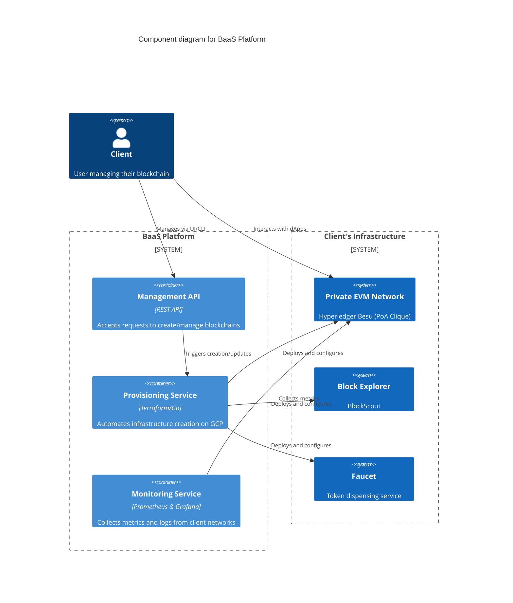
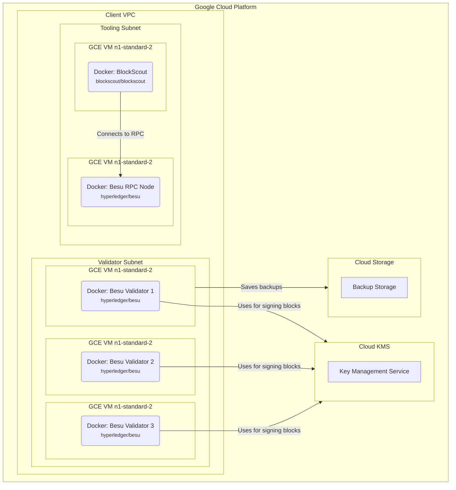
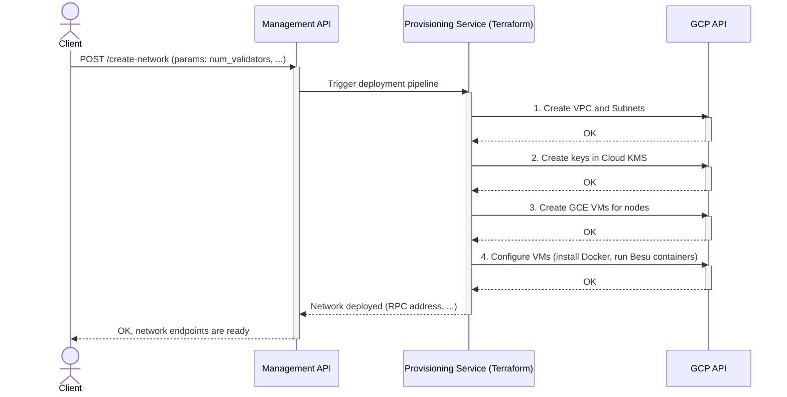
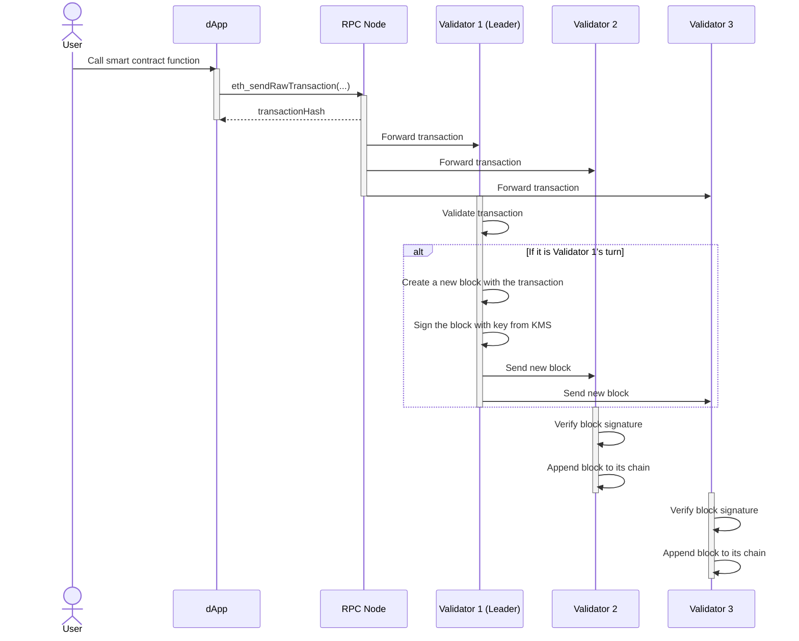

# Architecture Document: Private Blockchain as a Service (BaaS) on GCP

## 1. Introduction

This document describes the technical architecture for the "Private Blockchain as a Service" (BaaS) platform, based on the project roadmap and the detailed implementation guide. The goal is to provide developers with a clear vision of the system, its components, and their interactions for the upcoming development cycle.

**Key Technology Decisions:**
- **Cloud Provider:** Google Cloud Platform (GCP)
- **Consensus:** Proof of Authority (PoA) using Clique
- **Blockchain Client:** Hyperledger Besu
- **Containerization:** Docker (without Kubernetes)
- **Infrastructure as Code (IaC):** Terraform

---

## 2. Overall System Architecture

The system consists of three main layers: the **BaaS Control Plane**, the **Client Plane**, and the **Infrastructure Plane**.

### C4 Component Diagram

This diagram shows the high-level structure of the system and its main components.

---

## 3. Deployment Architecture

Each client's components are deployed in an isolated environment within GCP using Docker containers on Compute Engine (GCE) virtual machines.

### Deployment Diagram

This diagram illustrates how components are mapped to the physical GCP infrastructure.

**Description:**
- **Isolation:** Each client gets their own Virtual Private Cloud (VPC) for complete resource isolation.
- **Nodes:** Validators, RPC nodes, and tools (Block Explorer) run as Docker containers on separate GCE VMs for fault tolerance.
- **Security:** Validator private keys are stored and managed in **GCP Cloud KMS**. Besu nodes access the keys via an API, which prevents keys from being stored on disk.
- **Backups:** Blockchain data is periodically archived to **Google Cloud Storage**.

---

## 4. Data Flows and Interactions

### 4.1. New Network Provisioning Flow

This process is initiated by the client and fully automated by the provisioning service.

#### Sequence Diagram

**Description:**
1.  The client sends a request to create a network via the API.
2.  The Management API triggers the process in the **Provisioning Service**.
3.  The service, using Terraform, sequentially creates an isolated network (VPC), validator keys (KMS), and virtual machines (GCE) in GCP.
4.  Each VM is configured with Docker and starts the appropriate Hyperledger Besu container with the correct configuration (genesis.json, reference to the KMS key).
5.  Upon successful deployment, the endpoints for accessing the new network are returned to the client.

### 4.2. Transaction Flow

This process describes how a user's transaction is handled in the Clique network.

#### Sequence Diagram

**Description:**
1.  A user initiates a transaction through a dApp.
2.  The dApp sends the transaction to one of the RPC nodes.
3.  The RPC node broadcasts the transaction to all nodes in the network.
4.  The validator whose turn it is (determined sequentially in Clique) gathers transactions into a block.
5.  It signs the block with its key (retrieved from KMS) and sends it to the other validators.
6.  Other validators verify the signature and, if valid, append the block to their local blockchain copies. The transaction is now considered confirmed.

---

## 5. Security Architecture

- **Key Management:** Validator node cryptographic keys are created and stored exclusively in **GCP Cloud KMS**. This prevents key compromise even if a virtual machine is breached.
- **Network Isolation:** Each client is deployed in its own **VPC**. Firewall Rules strictly limit traffic between nodes and from the outside. For example, RPC ports can be made accessible only from specific IP addresses.
- **Spam Protection:** Since transactions are free (`gasPrice=0`), **rate limiting** is configured on RPC nodes and the Faucet service to protect against DoS attacks.
- **IAM (Identity and Access Management):** Access to GCP resources (VMs, KMS, Storage) is strictly controlled via IAM roles, following the principle of least privilege.

---

## 6. Monitoring and Logging

- **Metrics Collection:** **Prometheus** (running in Docker) collects metrics directly from the Besu nodes (which have a built-in Prometheus endpoint).
- **Visualization:** **Grafana** (running in Docker) is used to create dashboards that display key network indicators:
    - Validator status (online/offline)
    - Blockchain height
    - Transactions per second (TPS)
    - Block creation time
- **Logging:** Logs from Docker containers are collected using **Google Cloud Operations** (formerly Stackdriver) for centralized analysis and alerting on anomalies.

---

## 7. Resources and Links

### 7.1. Official Documentation and Useful Resources

- **Google Cloud Platform (GCP):**
    - [Main Documentation](https://cloud.google.com/docs)
    - [Compute Engine (GCE)](https://cloud.google.com/compute/docs)
    - [Cloud KMS](https://cloud.google.com/kms/docs)
    - [Cloud Storage](https://cloud.google.com/storage/docs)
    - [Virtual Private Cloud (VPC)](https://cloud.google.com/vpc/docs)
- **Hyperledger Besu:**
    - [Official Documentation](https://besu.hyperledger.org/en/stable/)
    - [Clique PoA Consensus](https://besu.hyperledger.org/en/stable/Concepts/Consensus-Protocols/Clique/)
- **Infrastructure & Tooling:**
    - [Terraform Documentation](https://www.terraform.io/docs)
    - [Docker Documentation](https://docs.docker.com/)
    - [BlockScout Documentation](https://docs.blockscout.com/)
    - [Prometheus Documentation](https://prometheus.io/docs/introduction/overview/)
    - [Grafana Documentation](https://grafana.com/docs/grafana/latest/)

### 7.2. GCP Services and Configuration Parameters

This table summarizes the key services and configuration parameters for deploying and operating the BaaS platform.

| Resource/Service            | Purpose in BaaS Platform                                     | Key Parameters / Configuration                                                                                                   | Alternatives / Notes                                                                                                                                                                                             |
| --------------------------- | ------------------------------------------------------------ | -------------------------------------------------------------------------------------------------------------------------------- | ---------------------------------------------------------------------------------------------------------------------------------------------------------------------------------------------------------------- |
| **Compute Engine (GCE)**    | Hosting Validator, RPC, and Tooling nodes as VMs.            | - **Machine Type:** `n1-standard-2` (or higher, based on load)   - **Boot Disk:** SSD for I/O performance   - **OS Image:** Ubuntu/Debian | Can be replaced with Google Kubernetes Engine (GKE) for more complex orchestration, but the current architecture prioritizes simplicity with Docker on GCE.                                                    |
| **Cloud KMS**               | Securely storing and managing validator private keys.        | - **Key Ring Location:** Same region as GCE VMs   - **Protection Level:** `SOFTWARE` or `HSM`   - **IAM Permissions:** Grant `cloudkms.signer` role to the service account of Besu nodes. | HashiCorp Vault could be an alternative but adds management overhead. Using KMS is a native and secure solution within GCP.                                                                                |
| **Cloud Storage**           | Storing periodic backups of blockchain data.                 | - **Storage Class:** `Standard` or `Nearline` for cost-efficiency   - **Lifecycle Rules:** Automatically delete old backups.   - **Location:** Multi-regional for high durability. | Other cloud storage providers (e.g., AWS S3) could be used, but GCS offers seamless integration and performance within the GCP ecosystem.                                                                    |
| **Virtual Private Cloud (VPC)** | Providing network isolation for each client's blockchain.    | - **Firewall Rules:** Restrict ingress traffic to specific ports (P2P, RPC, SSH) and source IPs.   - **Subnets:** Separate subnets for validators and public-facing tools. | -                                                                                                                                                                                                                |
| **Cloud Operations (Logging)** | Centralized logging for all Docker containers and VMs.       | - **Log Sinks:** Configure sinks to export logs to BigQuery for long-term analysis or to Pub/Sub for real-time alerting.   - **Log-based Metrics:** Create metrics for specific events (e.g., errors). | The ELK stack (Elasticsearch, Logstash, Kibana) is a powerful open-source alternative but requires self-hosting and management.                                                                            |
| **Identity & Access Management (IAM)** | Controlling access to all GCP resources. | - **Principle of Least Privilege:** Assign minimal required roles.   - **Service Accounts:** Use dedicated service accounts for applications (e.g., Besu, Provisioner). | -                                                                                                                                                                                                                |
| **Prometheus & Grafana**    | Monitoring network health and performance metrics.           | - **Prometheus Targets:** Configure to scrape metrics from Besu's `/metrics` endpoint.   - **Grafana Dashboards:** Import or create dashboards for key Besu metrics. | GCP's native Cloud Monitoring can be used as an alternative to self-hosted Prometheus/Grafana, offering tighter integration but potentially less customization.                                               |